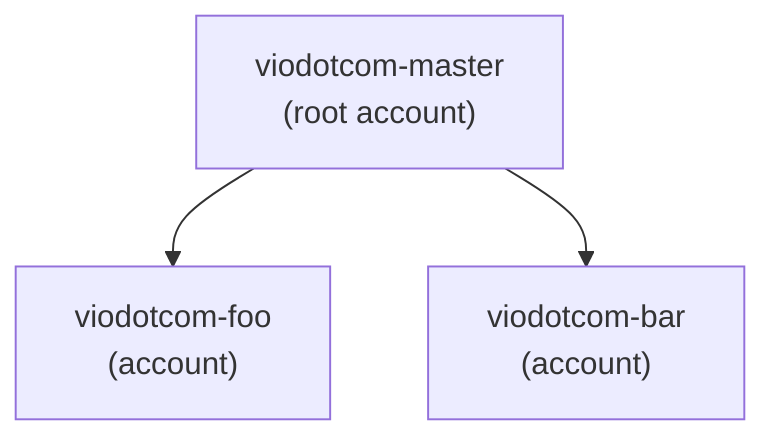

# Vio.com System Administrator assignment

## Introduction

This assignment is part of the recruitment process for the System Administrator at Vio.com. The purpose is to assess the technical skills of the candidates in a generic scenario.

Please read carefully all the instructions before starting to work on your solution, and feel free to contact us if you have any doubt.

## Setup

*Note:* You need to fork this repository to work on your solution to the assignment.

The repository has the following content:

* A [Dockerfile](./Dockerfile) to build the docker image for the assignment.
* A [Makefile](./Makefile) to be used to execute all the necessary steps of the assignment.
* A [ldap](./ldap/) directory with LDIF file to be used as a sample.

The `Dockerfile` is based on the OpenLDAP image, with all the necessary commands to used during this exercise.

There's also a `Makefile` for reference with a target that executes the two LDIF files as an example. We also have included an empty `run` target, which is the default one for the `make` utility.

### What we expect

We expect that you add more targets for all steps of your solution to trigger them in the correct order from the `run` target. It means that once executed, LDAP is configured in the right way.

### How we will validate your solution

To validate your solution we're going to:

* Build the docker image

```docker
docker build -t viodotcom/assignment .
```

* Run the docker container to connect to the LDAP:

```docker
docker run -it --rm viodotcom/assignment
```

* Check the LDAP tree and the objects created after the execution of `make` utility:

```docker
ldapsearch -x -H ldap://localhost -b dc=viodotcom,dc=com -D "cn=admin,dc=viodotcom,dc=com" -w <passwd>
```

We'll also take a look if you created any extra file or edited the current one under the `ldap/` directory.

## Assignment

The objective of this assignment is to define and configure a structure for security groups in the Vio.com directory.
Remember to create the objects necessary in a set of different LDIFs or inside a uniq file, and to add them to the target of the `Makefile` since we want all objects created with the `make` utility.

Feel free to create diagrams and a `README` to clarify and justify your decisions.

### The problem

Currently at Vio.com, we have our directory access configured in the SSO system, which gave us much less flexibility than the most used directory systems available on the market, forcing us to have a non-ideal segregation. So, we start to consider migrating to a different system, such as openLDAP.

However, to decide if it's the right choice, we need to do a PoC and validate a possible setup for the new LDAP with a Directory Information Tree (DIT) that satisfies the following requirements:

* **Team structure:** Inside each team we would have different roles such as Engineer Manager (EM), Tech Lead (TL), Product Manager (PM) and the Engineers (IC).

* **Privileges:** Depending on the system we may have different privileges for each role such as `Administrator`, `PowerUser`, `Read Only`.

* **PII data:** At Vio.com we care about customer data, and every year we have a PCI DSS audit to review and to ensure that our systems are properly configured to handle sensitive information. So, we need a segregation of `sensitive` and `nonsensitive` systems where we can ensure that only the necessary employees have access there.

### Current structure

Currently, we have the following team structure:

* **Platform team:** Inside the Engineering chapter, one of the duties of the platform team is to provide access across different systems to the Vio.com employees. Are part of the platform team the following users:
  * Charlie: Eng Manager
  * Jessica: Tech Lead
  * David: Sr Engineer
  * Jhon: Sr Engineer

* **Foo team:** Inside the Engineering chapter, it's a frontend team responsible for the `Foo product`, they have to develop new features, promote it to production, maintain and troubleshoot the service. Are part of the platform team the following users:
  * Carlos: Eng Manager
  * Isla: Product Manager
  * Christian: Tech Lead
  * Amanda: Sr Engineer

* **Bar team:** Inside the Engineering chapter, it's a frontend team responsible for the `Bar product`, they have to develop new features, promote it to production, maintain and troubleshoot the service.
  * Adam: Eng Manager
  * Nairobi: Product Manager
  * Ben: Tech Lead
  * Dora: Sr Engineer

### The systems

For this assignment let's considering the following systems:

* **Cloud provider (AWS):** Each product has your own AWS account, so you can consider the following setup.



* **Monitoring tool (Datadog):** Datadog provides all monitors, dashboards, logs and events inside the same instance for every team. Varying only if the user has `Admin`, `Read write` or `Read only` access.

### Task 1

Define the best approach to handle those requirements for the DIT, feel free to propose different groups, organization units (OU) or any other logic that you may have. The important thing here is that the approach satisfies the requirements and that the strategy is crystal clear.

**Tip:** You can consider group people by product, by functional role (EM, TL), by privilege. Users could be part of one or more groups, if necessary.

You can create a `README` explaining your decision, using [mermaid](https://github.com/mermaid-js/mermaid) as used before, or a simple draw outside of GitHub, as you prefer.

### Task 2

It's time to implement. So, you need to populate the LDAP tree (DIT) reflecting the idea shared on Task 1, creating all the objects as well as the users listed above.

### References

* [Structure of an LDAP directory tree](http://www.novell.com/documentation/opensuse110/opensuse110_reference/data/sec_ldap_tree.html)
* [Simple LDAP DIT](https://www.zytrax.com/books/ldap/ch5/)
