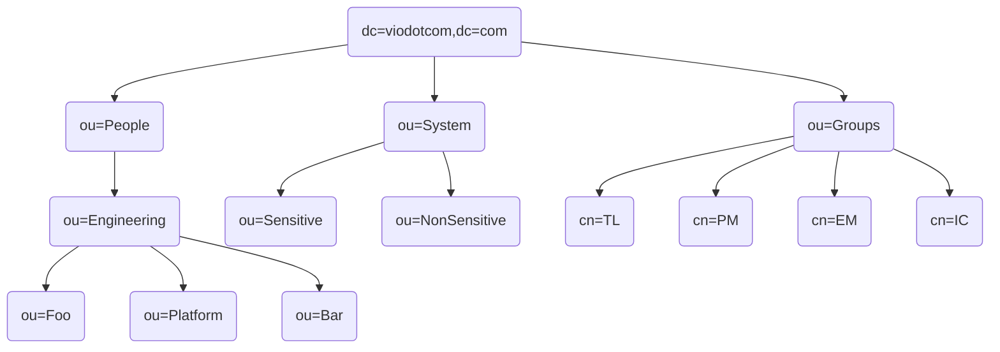

# Vio.com System Administrator assignment/Resolution

This repository contains the LDAP structure setup for Vio.com, designed to streamline user, system, and group management within the organization. Below is an overview of the Directory Information Tree (DIT), the organizational units (OUs), and their purpose within this LDAP server.

## Directory Information Tree (DIT) Overview

This LDAP structure is organized into three main Organizational Units (OUs): People, Systems, and Groups. Here's a brief outline and the rationale behind each OU
### People OU
* **Path**: ou=People,dc=viodotcom,dc=com
* **Description**: This OU contains all individuals within the organization. It's further subdivided into an Engineering department sub-OU, which then branches into Foo, Platform, and Bar teams. This structure allows us to organize users based on their team affiliations.
* **Sub-OUs**:
     * ou=Engineering,ou=People,dc=viodotcom,dc=com
     * ou=Foo,ou=Engineering,ou=People,dc=viodotcom,dc=com
     * ou=Platform,ou=Engineering,ou=People,dc=viodotcom,dc=com
     * ou=Bar,ou=Engineering,ou=People,dc=viodotcom,dc=com

### Systems OU
* **Path**: ou=Systems,dc=viodotcom,dc=com
* **Description**: This OU categorizes systems into Sensitive and Non-Sensitive sub-OUs. This separation aids in applying different security measures based on the sensitivity of the systems.
* **Sub-OUs**:
     * ou=Sensitive,ou=Systems,dc=viodotcom,dc=com
     * ou=NonSensitive,ou=Systems,dc=viodotcom,dc=com

### Groups OU
* **Path**: ou=Groups,dc=viodotcom,dc=com
* **Description**: Contains groups for managing roles (and further more access) within the organization. Given the limitations of dynamic groups in the current version of OpenLDAP and to avoid the complexity of modifying the LDAP schema with custom attributes, members of groups under this OU are manually added these groups: TL, EM, PM, and IC.

## Access Control and Management
System-level access is managed externally through system ACLs or IAM of that particular/forgion system and/or via external documentation, avoiding unnecessary complexity within the LDAP structure. For example if EM needs to have Admin access on AWS and R/W access on Datadog it would add complexity layer to this DIT structure and overwhelming situation for system admins such as having system-specific-access-level (aws-admin, aws-RW, aws-RO, datadog-admin, datadog-RW, and datadog RO) or more dlap-generic-access-level (Admin, RW, and RO). Since system-level permissions are assessed based on roles/functions, already reflected through membership in the groups within given LDAP structure, an assumption that this requirement is met is implied.

## Points of Improvement
* Use an Up-to-Date Docker image for OpenLDAP to facilitate more ldap features.
* Hashing users' passwords in the prod-users.ldif file.
* Clarification on PII and Sensitive/Non-Sensitive Systems.
* Adding Entrypoint script to run the "make" command instead of typing it manually once the container is fully running and accessible. 

## Conclusion
This LDAP structure provides a streamlined and organized approach to managing users, systems, and access within Vio.com. By maintaining a clear and simplified DIT, the aim is to enhance both operational efficiency and security.
